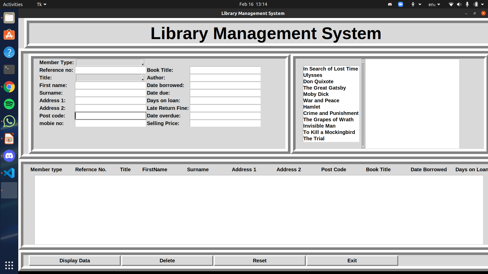
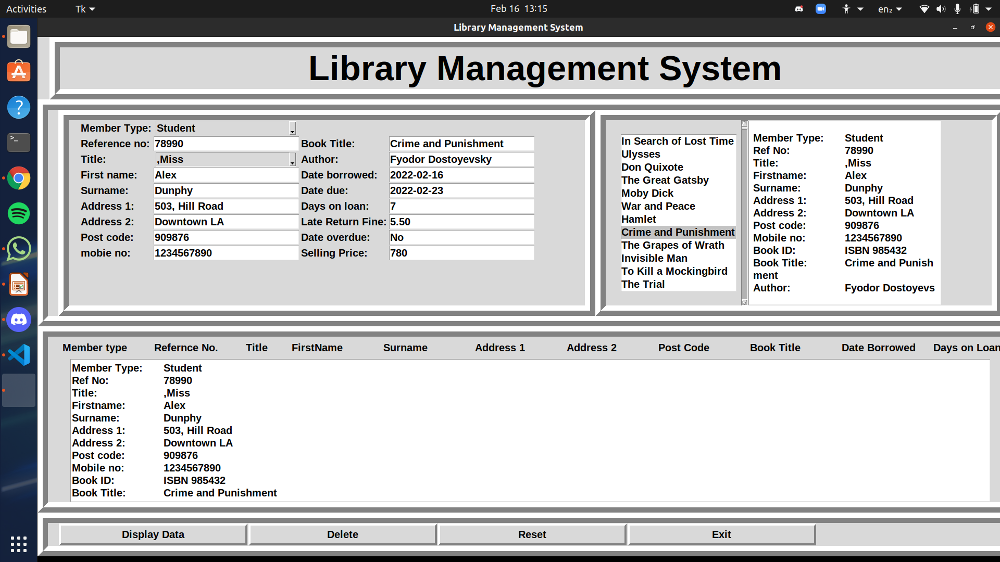
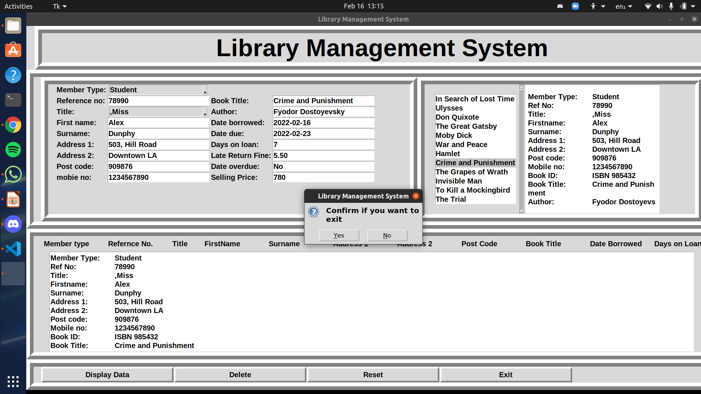

# Library-Management-System
Project of Library Management System in Python for **Learn for Cause** hackathon by **Women Of Code**
 
Library Management System, more popularly known as LMS, manages the resources in a library. It maintains up-to-date information and thus helps librarians focus on their jobs.
Further, it is built to increase efficiency, save valuable administration time, and lead to a better educational experience. 
The problem faced is that library users require an efficient method to find a specific book or keyword(s) within a book given a continuously expanding library.
Efficiency requires that the processing time should stay relatively the same even as the library contents increases.

Our code is a simple python code using libraries in python to built GUI once implemented it will help in effective managing of library with accuracy and will help in reducing human power and will thus save time and money and  could be implemented in various colleges, universities and institutions.


### Installations

``` 
pip install python-tk

```

### Technologies Used 
* Python
* tkinter for frontend

### Presentation 

https://bit.ly/3uUpWDm


### Screenshots









